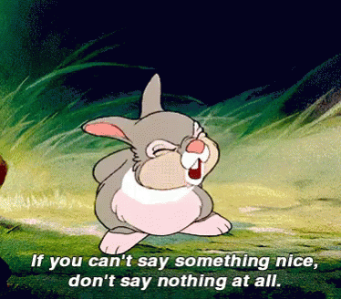

# Code Of Conduct

## INTRODUCTION

Our goal is to build an open community of people interested in learning, teaching, and building cool stuff!

This code is not exhaustive or complete. It serves to distill our common understanding of a collaborative, shared environment and goals. We expect it to be followed in spirit as much as in the letter, so that it can enrich all of us and the technical communities in which we participate.

## Specific Guidelines

### Be Respectful

*adj* - showing politeness

Listen to what others have to say, not just for your turn to talk.

### Be Kind

*adj* - of good or benevolent nature or disposition.

There is never a reason to not be kind. We are all human beings. 

### Assume positive intent

We ask that at all times you assume when dealing with the people of this community that everything is done with positivity and intended to be constructive. We ask also that you behave act with the same mindset.

When in doubt, follow Thumpers Rule:

If you can't say something nice (or constructive), don't say anything at all.

### Examples of Unacceptable Behavior

* Violent threats or violent language directed against another person
* Discriminatory jokes and language
* Posting sexually explicit or violent material
* Posting (or threatening to post) other people’s personally identifying information (“doxing”)
* Personal insults, especially those using racist or sexist terms
* Unwelcome sexual attention
* Advocating for, or encouraging, any of the above behavior
* Repeated harassment of others. In general, if someone asks you to stop, then stop

## DIVERSITY STATEMENT

No matter how you identify yourself or how others perceive you: we welcome you. Though no list can hope to be comprehensive, we explicitly honour diversity in: age, culture, ethnicity, genotype, gender identity or expression, language, national origin, neurotype, phenotype, political beliefs, profession, race, religion, sexual orientation, socioeconomic status, subculture and technical ability.

## REPORTING GUIDELINES
While this code of conduct should be adhered to by participants, we recognize that sometimes people may have a bad day, or be unaware of some of the guidelines in this code of conduct. When that happens, you may reply to them and point out this code of conduct. Such messages may be in public or in private, whatever is most appropriate. However, regardless of whether the message is public or not, it should still adhere to the relevant parts of this code of conduct; in particular, it should not be abusive or disrespectful.

If you believe someone is violating this code of conduct, you may reply to them and point out this code of conduct. Such messages may be in public or in private, whatever is most appropriate. Assume good faith; it is more likely that participants are unaware of their bad behaviour than that they intentionally try to degrade the quality of the discussion. Should there be difficulties in dealing with the situation, you may report your compliance issues in confidence to either:

NOTE: THIS IS NOT FINAL, just a proposal
Daniel Slutsky
Jake Nylund
Sami Kallinen